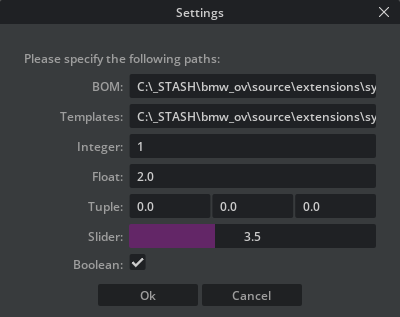

# Popup Dialogs 

https://docs.omniverse.nvidia.com/kit/docs/omni.kit.window.popup_dialog/2.0.24/omni.kit.window.popup_dialog.html


### FormDialog — easy data input with omni.kit.window.popup_dialog

If you need to create popup dialog widgets e.g. to display and change data there are a very convenient classes in omni.kit.window.popup_dialog to perform that with a few lines of code:



```python
from omni.kit.window.popup_dialog import FormDialog

# handle when ok is pressed: 
def _on_settings_ok(self, dialog: FormDialog):
    values = dialog.get_values()
    self._bom_path = values["bom"]
    # more getting values ...
    self._setting_dialog.hide()  

# build the dialog just by adding field_defs 
def _build_settings_dialog(self) -> FormDialog:
    
    field_defs = [
        FormDialog.FieldDef("bom", "BOM:  ", ui.StringField, self._bom_path),
        FormDialog.FieldDef("templates", "Templates:  ", ui.StringField, self._templates_path),
        FormDialog.FieldDef("int", "Integer:  ", ui.IntField, 1),
        FormDialog.FieldDef("float", "Float:  ", ui.FloatField, 2.0),
        FormDialog.FieldDef(
            "tuple", "Tuple:  ", lambda **kwargs: ui.MultiFloatField(column_count=3, h_spacing=2, **kwargs), None
        ),
        FormDialog.FieldDef("slider", "Slider:  ", lambda **kwargs: ui.FloatSlider(min=0, max=10, **kwargs), 3.5),
        FormDialog.FieldDef("bool", "Boolean:  ", ui.CheckBox, True),
        
    ]
    dialog = FormDialog(
        title="Settings",
        message="Please specify the following paths:",
        field_defs=field_defs,
        ok_handler=self._on_settings_ok,          
    )
# show it 
dlg = self._build_settings_dialog()
dlg.show() 

# see also example in create...\omni\kit\window\popup_dialog\tests\test_form_dialog.py         
```

