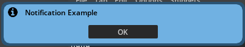

# post notification 


[Documentation](https://docs.omniverse.nvidia.com/kit/docs/kit-sdk/latest/source/extensions/omni.kit.notification_manager/docs/index.html#omni.kit.notification_manager.post_notification)

```python
from omni.kit.notification_manager import post_notification, NotificationStatus

post_notification("Notification 1, default duration")
post_notification("Notification 4 (warning), with 4 second duration", duration=4, status=NotificationStatus.WARNING)

# status values: 
# NotificationStatus.INFO | NotificationStatus.WARNING

# simple ok box with callback 
import omni.kit.notification_manager as nm

ok_button = nm.NotificationButtonInfo("OK", on_complete=lambda:print("clicked"))
notification = nm.post_notification(
            "Notification Example", hide_after_timeout=False, duration=0,
            status=nm.NotificationStatus.INFO, button_infos=[ok_button])

```

